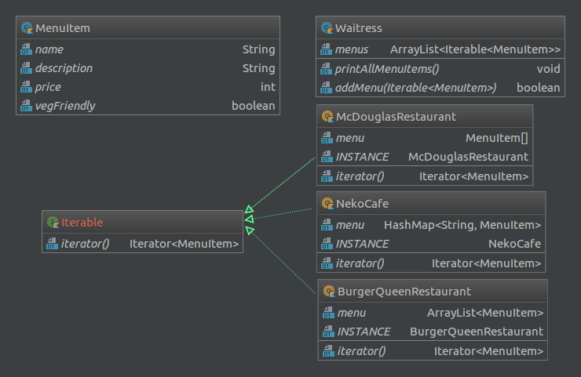

# Simple Mock-up chat app that uses the Template and Observer design patterns

## Background

This demo is based on the following specification:

> Two restaurants use different collections to store their menu items,
> but both of them use the same `MenuItem` class. The restaurants decide
> to merge. The restaurant’s waitress should be able to access both
> menus. Finally, a cafe that stores its menu items within a Hashtable
> decides to merge with the restaurants and still, the waitress should
> be able to access the menus of the three restaurants. Use the iterator
> pattern to solve this.

It was developed as part of the activities of the 2018 Modeling and
Programming course taught by Prof. Rosa Victoria Villa Padilla at the
[Science Faculty](http://www.fciencias.unam.mx/) of the [National
Autonomous University of Mexico](https://www.unam.mx/).

## Design

The following design patterns were used:

  - Singleton for the restaurant classes.
  - Iterator in the restaurant classes so the waitress class could
    iterate seamlessly over the elements in all the menus she has access
    to.

## Building and running the program

The program can be built using gradle, the most common tasks are
described bellow, for a full list of available tasks use `./gradlew
tasks`. If you’re on Linux or Mac then running the following command
from the project’s main directory will be enough to build and run the
program: `./gradlew run`. If you’re on windows use `gradlew.bat run`
from the command prompt instead.

Some of the most common tasks are:

1.  `./gradlew build`, compiles and creates the outputs of this project.
2.  `./gradlew dokka`, generates the program’s documentation and puts it
    inside `build/javadoc`.
3.  `./gradlew run`, builds the program and runs the application.
4.  `./gradlew clean`, deletes all files and folders generated during
    the build process (except the .gradle directory).

## Acknowledgements

For more information on the tools used to build, create and run this
program refer to the following links:

  - [Pandoc](https://pandoc.org/) is a Haskell library for converting
    from one markup format to another, and a command-line tool that uses
    this library. Pandoc was used to keep this README file consistent.
  - [Gradle](https://gradle.org/) was used to create the build script.
  - [Dokka](https://github.com/Kotlin/dokka) was used to provide
    beautiful documentation.
  - [JetBrains’ IntelliJ IDEA](https://www.jetbrains.com/idea/) was used
    as the primary editor. Its diagramming utility also came in handy to
    produce the application’s class diagram.

## Figures

